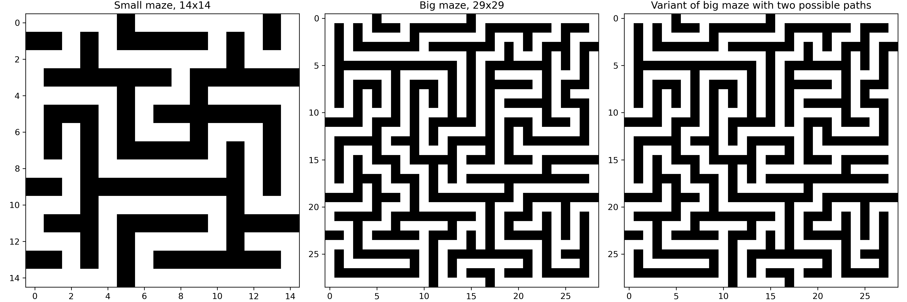

# lab_qlearning

You first need to install the following packages:
```
numpy matplotlib tqdm seaborn
```

Then you can run an experiment with the following command:
```
python main.py  # you can add arguments to change the default values
```

- `path_maze` : Specifies the path to the maze file. Default is None.

- `nrows` : Specifies the number of rows in the maze. Default is 8.

- `ncols` : Specifies the number of columns in the maze. Default is 12.

- `p` : Sets the probability of a wall being placed in a cell of the maze. Default is 0.5.

- `gamma` : Sets the discount factor for the Q-learning algorithm. Default is 0.9.

- `seed` : Sets the seed for the random number generator. This is used for reproducibility. Default is 0.

- `policy` : Sets the policy used for action selection. Default is "eps_greedy".

- `horizon` : Sets the horizon for the MDP. Default is 10000.

- `eps` : Sets the epsilon value for the epsilon-greedy policy. Default is 0.5.

- `tau` : Sets the tau value for the softmax policy. Default is 0.5.

- `alpha` : Sets the learning rate for the Q-learning algorithm. Default is 0.4.

- `nb_iter` : Sets the number of iterations for the Q-learning algorithm. Default is 10,000,000.

Otherwise, you can explore the notebook `results.ipynb` that shows the results of some experiments.

We also used classical maze, one of size 14x14 and one of size 29x29. We slightly modified the big one to add another path to the exit.



Maze generated [here](https://keesiemeijer.github.io/maze-generator/#generate) then preprocessed to match our format and saved to `.npz` files in `custom_mazes/`.